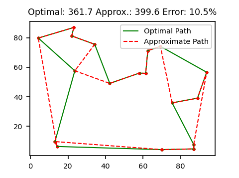

### Intro

The traveling salesman problem (TSP) is a classic NP-complete problem.

The problem consists of a salesman who must travel from home, to a set of cities, and return home.  His objective is to find the shortest possible path to do so.  The problem of course does not need to be cities and roads.

Think of the problem in terms of vertices (cities) that are fully connected by a set of edges (roads).  The solution to this probelm can be applied to a wide variety of situations.

### Methods

####<b>The brute force approach:</b>
1. generate all permuations of N cities
2. calculate the cost of the path created by each permuation
Here, the cost to travel from city A to city B is the distance between cities A and B.
However, different instances of the problem may have different cost functions.
3. return the lowest cost path
which works... but scales with O(n!) which makes this approach infeasible for sets of cities larger than &approx; 12.

The time and space complexity of the solution can be greatly improved through dynamic programming.

####<b>The dynamic programming approach:</b>
1. Choose a specific starting city.
We must travel to every city once, so it does not matter which city you choose.
2. Store the visited cities in a bit-masked integer.
i.e. 106 = '0b1101010' means we have visited cities 1, 3, 5, and 6 (counting the '1' bits from the right)
3. At each iteration, consider visiting all N cities next.
If a city has already been visited (as shown in the bit-mask) then do not visit it a second time.
Otherwise try visiting the city for the cost of distance(current_city, next_city) plus the cost to visit the remaining cities.

This is the bones of the DP solution, but thus far it is not much better than the brute force solution.

Why? Because it is currently lacking memoization.

Consider the following scenarios for a case of 7 cities, 
A: the salesman visits city 1, 3, 2, 4 
B: the salesman visits city 1, 2, 3, 4 

Journies A and B may have different costs, but the <b>best</b> possible path from city 4 to cities {5, 6, 7} and returning home to city 1 must be the same for both path's A and B.  Once the optimal path from 4 -> {5, 6, 7} -> 1 has been calculated once in scenario A, it would be a duplication of effort to calculate it again for scenario B.

Remembering the minimum cost and best path from the state (current_city, visited_cities) allows us to skip these calculations the second, third, ...Nth time the state is visited.  

This reduces the time complexity of the solution from O(n!) to O(n2&middot;2n).
This is a substantial improvement, which allows us to calculate the optimal solution for up to &approx; 20 cities.

At this point, you might be thinking 20 cities is not a lot of cities, and you are right.
However, in order to further improve the time complexity of our solution, we must forego accuracy.

####<b>The heuristic approach:</b>

1. Calculate the minimum spanning tree (MST) of the set of cities.
This can be done with Prim's Algorithm or Kruskal's Algorithm.
Kruskal's Algorithm was implemented here - see TSP_heruistic.py >> heuristic_path
2. Create a path based on the preorder traversal of the MST.
3. Repeat step 2 for all N cities and return the path that has the minimum cost.

The third step is what dominates the time complexity analysis.  Each pre-order terversal is an O(n) operation, and we are preforming the operation once for each city resulting in O(n2) time complexity.

### Comparisons

Let's take a look at a very rough estimate for the number of operations required for a set of 20 cities for each of the 3 methods mentioned so far:

| method | time complexity | approximate operations for 20 cities |
|:---:|:---:|:---:|
|Brute Force| O(n!)| &approx; 2&middot;1018|
|Dynamic Programming |O(n22n)| &approx; 4&middot;108 | 
|Heuristic Approach | O(n2) | &approx; 800* |
<i>*Generating a list of edges for Kruskal's Algorithm is also O(n2) - could be improved.</i>

Clearly the heuristic approach is much faster than the optimal solution using dynamic programming.
However, the increase in speed comes at the cost of accuracy.  The relative accuracy of the heuristic algorithm compared to the optimal solution is given in the table below.

| n | (heuristic - optimal) / optimal | | n | (heuristic - optimal) / optimal |
|:----:|:---:|:---:|:---:|:---:|
| 3  | 0.0% | | 12  | 6.8% |
| 4  | 0.3% | | 13  | 7.3% |
| 5  | 1.0%  | | 14  | 8.5% |
| 6  | 1.6%  | | 15  | 9.0% |
| 7  | 2.3%  | | 16  | 9.6% |
| 8  | 2.8%  | | 17  | 10.5% |
| 9  | 4.3%  | | 18  | 13.1% |
| 10  | 5.4%  | | 19 | 13.6% |
| 11  | 6.2%  | | 20 | 14.0% |
<i>*{18, 19, 20} calculated from 20 samples, {3 - 17} calculated from 100 - 1000 samples.</i>

### Thoughts:

This method is looking pretty good.  In a situation where you have 20 or less nodes, sufficient memory, and it is important to have the optimal result, the dynamic programming solution is probably still the way to go.

However in situations, such as an AI player deciding on what path to follow in a game, where it is important to make quick decisions, a slightly less optimal result at the cost of 1 millisecond wall time will be preferable to an optimal result at the cost of 30 seconds wall time. 

And of course, if you have hundreds or thousands of nodes, then the heuristic method is really the only option.

But can we do better and while maintaining a time complexity of O(n2)? <b>Absolutetly.</b>

Let's compare a few of the optimal and approximate tour pairs to get an idea of where we can improve.

### Optimal versus Approximate Tours:

<b>10 Nodes</b> 

<b>14 Nodes</b> 

<b>18 Nodes</b> 

### Observations:

1. When there are fewer nodes, the heuristic approach will often find the optimal path
2. Often, the error originates due to the path taking a detour through a point that would obviously fit better elsewhere in the path

### Idea:

Think of the path like a rubber band.  If we take out a point, the path will fill the gap by connecting the 2 neighboring points 2.

In doing so, the rubber band will relax a little because it is not being stretched as far.

However, we need to visit all the points so we must re-insert the point between two of the existing nodes in the path.

But, perhaps there is a better place in the path for this point than where we removed it from.  

Look at the approximate path for the 14 node plot.  Now picture removing the node at (42, 22) from the plot. The rubber band would relax by connecting nodes (60, 5) and (50, 35).  Insert the point (42, 22) back into the path, which two nodes should it go between?  The two nodes that will stretch the rubber band the least.  In this case (25, 21) and (50, 35).  

### Improvement to the heuristic method:

I call this improvement relaxation because it is relaxing the tension in the hypothetical rubber band.  

It is a simple and intuitive idea for improving the heuristic and as such probably already has a more formal name.

To relax the path:
1. For each node (b) calculate the cost of removing it from the path. 
<b>removal_cost = distance(a, c) - distance(b, c) - distance(a, b)</b>  
where a and c are the neighbors of node b in the path 
removal_cost will be negative because we are removing tension from the path by removing node b 
2. For each pair of neighboring nodes, calculate the cost of inserting node b 
<b>insertion_cost = distance(a, b) + distance(b, c) - distance(a, c)</b>
insertion cost will be non-negative because we are stretching the band to insert point b 
3. Insert node b at the location that will have the greatest overall relaxation for the band 
<b>total_relaxation = insertion_cost + removal_cost</b> 
4. Repeat for all nodes in the path
5. Repeat steps 1 - 4 until there are no gains from path relaxation (typically 1 or 2 cycles in total)

### Comparisons

| n | (heuristic - optimal) / optimal | | n | (heuristic - optimal) / optimal |
|:----:|:---:|:---:|:---:|:---:|
| 3  | 0.00% | | 12  | 1.25% |
| 4  | 0.00% | | 13  | 1.36% |
| 5  | 0.00%  | | 14  | 2.18% |
| 6  | 0.07%  | | 15  | 2.80% |
| 7  | 0.11%  | | 16  | 3.12% |
| 8  | 0.31%  | | 17  | 3.18% |
| 9  | 0.40%  | | 18  | 4.22% |
| 10  | 0.71%  | | 19 | 4.52% |
| 11  | 1.19%  | | 20 | 4.48% |
<i>*{20} calculated from 50 samples, {3 - 19} calculated from 100 - 1000 samples.</i>