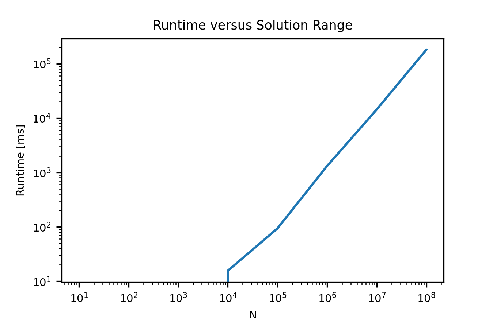

## Waring's Problem with Pyramidal Numbers

This problem is a spin-off of <a href="https://en.wikipedia.org/wiki/Waring%27s_problem">Waring's problem</a>, an example of which asks if every natural number can be represented by the sum of four squares.    

<b>Problem Statement:</b> For every natural number x in the range 1 to 109, find a combination of 5 or less pyramidal numbers that sum to x.   
i.e. 424 is the sum of (35, 56, 84, 84, 165); pyramidal numbers follow (n3 - n) / 6 for n >= 2.  

The problem was plucked from one of the many "war stories" - real life programming challenges -  shared by Prof. Skiena in "The Algorithm Design Manual."  

Skiena uses this story as a segue to discuss how wisely selecting an efficient algorithm can be much more beneficial than implementing parallel programming and to caution the reader about calculating the best way to balance the load before starting a time intensive program on a cluster. It was both an informative and entertaining read.  

### Nomenclature:

N: the maximum number for which to find a solution 
pi: the ith pyramidal number 
P: the number of pyramidal numbers less than or equal to N 
x: an integer in [1, N] 
Xi: an group of x values where each x has a solution x = p1 + p2 + ... + pi where i <= 5 

### Settings:

<b>SOLVE_ALL</b>: will find the solution x = p1 + p2 + p3 + p4 + p5 for all x in range [1, N]. 
Takes advantage of memoization, using x that already have a solution to reduce the total run time:  &approx;181s for all x in the range [1, 108] 
<b>Caution:</b> Has O(N) space complexity.
  

<b>SOLVE_RANGE</b>: finds a solution for x in range [start, start + size]. 
Uses binary search and pruning methods to narrow the search space. 
Does not use memoization, but in turn requires very little memory.
  

<b>PLOT_RUNTIMES</b>: plots runtime vs N. 
This should be run separate from SOLVE_ALL since it will write over memo. 
Here is the resulting plot: 

### SOLVE_ALL Details:

When solving for all x in the range [1, N] we can take advantage of previously solved x to reduce the runtime.  

1. Generate all pyramidal numbers less than N and store them in a sorted list. 
The (n-1)th pyramidal number is (n3 - n) / 6 where n >= 2. 
There are 1816 pyramidal numbers less than 109.  

2. Use an array of N+1 lists to record the solution for each number. 
N+1 is chosen because python is 0 based and we are seeking a solution for [1, N]. 
An array is selected instead of a hash table or a set because we know the exact size necessary and it requires a little less time to access elements.  

3. Start small, populate all of the P pyramidal numbers with a list of length 1. (P = 1816) 
    
    

    
    
Thought process: (click to show)

    
    At this point we could iterate over the remaining N - P numbers and find a combination of 2 pyramidal numbers that adds up to it... or for each solution of     length 1 that we already have we could iterate over the P numbers pyramidal numbers to find what numbers they sum to.  
    
    The first option would require P&middot;(N - P) operations before pruning, the latter requires P2 operations before pruning.  Since N is much greater     than P, the latter option is the smarter way to go.  
    
    

     
    

    
    
Notes on pruning: (click to show)

    
    Pruning refers to reducing the search space by skipping unnecessary calculations. 
    Here this means breaking out of for-loops early at opportune times.   
    For example, the first 8 pyramidal numbers are [1, 4, 10, 20, 35, 56, 84, 120]. 
    If we were only looking for pyramidal numbers up to N = 100, when checking for pairs that include 84 we would check 84 + 1, 84 + 4, 84 + 10 ... and then stop.     
    There is no need for us to check 84 + 20, 84 + 35, 84 + 56, or 84 + 84 because all of these sum to greater than N = 100. 
    
    

    
4. Iterate over all solutions of list lenght 1 (all the pyramidal numbers) and for each number try adding all pyramidal numbers that are less than or equal to it to create a new number, the sum of 2 pyramidal numbers.  We iterate over i [p0, p1, ..., pP] on the outer loop and j [p0, p1, ..., pi] on the inner loop to avoid duplicating effort.  i.e. we avoid considering p15 + p500 and then p500 + p15 later on.  This reduces our operations from P2 to P&middot;(P - 1) / 2  

5. For each x where memo[x] is of length 2, try adding all P to x to find a length 3 solution memo[x+pi] = memo[x] + [pi].  This is the crux of the SOLVE_ALL solution as it requires P&middot;X2 operations before pruning where X2 is the number of solutions of length 2.   
    
    

    
    
Thought Process: (click to show)

    
    Here we have another choice.  Our next challenge is to calculate the solution for x values where memo[x] is of length 4. We could continue the current pattern     iterating over P&middot;X3 which will find all x where memo[x] is length 4.  However, roughly 44% of values from [1, N] belong to X3 and as     a result there are a lot of length 4 solutoins that have overlapping lenght 3 + 1 solutions.  A more efficient approach is actually to reuse our X2     solutions in the same way that we used X1 solutions to find X2 solutions.  This requires X2&middot;(X2 - 1) / 2     operations which after pruning turns out to be roughly 10 times faster than using X3 and X1 to find X4  for N = 107.      This factor becomes greater with increasing N.  
    
    

    
6. Finally all that is left to find are the numbers that were missed by step 5 and belong to X4 and the numbers that belong to X5.  This is a small fraction of the total numbers, so it will be quickest to iterate over the x values that do not yet have a solution, and for each x value, iterate over all pi less than x to see if x - pi belongs to X3 or X4.  

### SOLVE_RANGE Details:

This approach is useful when calculating solutions for x greater than 108 because it does not require O(N) memory. 

It is reasonably fast, for x up to &approx; 1015, but on average it is much slower than SOLVE_ALL.  

1. Calculate pyramidal numbers up to start + size. 
start is the smallest x we want to solve for. 
start + size is the largest x we want to sovle for.  

2. Recursively solve for each x. 
Start by checking if x is a pyramidal number. 
Otherwise try subtracting the largest pyramidal number pi from x where pi < x and adding pi to the path. 
Repeat until x is a pyramidal number, then the solution is path + [x].  

<b>Optimizations</b>: 
1. Because the pyramid numbers are in sorted order, each iteration we can use binary search to find the largest pyramidal number that is smaller than x.  This requires O(log(P)) time where P is the number of pyramidal numbers.  This allows us to start from the largest pyramidal number less than x without needing to iterate over all pyramidal numbers greater than x first. 
2. Continuing on the thought process from optimization 1.  The recursive helper functoin will try x - p1, then x - p1 - p1, then x - p1 - p1 - p1, ... with a goal of reaching x is in {P}.  By starting with the largest possible p at each iteration x - p200, x - p200 - p17, x - p200 - p17 - p3, ... we will converge to a solution much faster.  This is why we iterate over [j, 0] instead of [0, j].

<b>Example1:</b>

Output: 
function_name: runtime in milliseconds 
x followed by a list of pi values that sum to x 

SOLVE_RANGE = True 
START = 1012 
SIZE = 3 

solve_single: 170 ms 
1000000000000 [999965999340, 33710236, 221815, 52394, 16215]  

solve_single: 165 ms 
1000000000001 [999965999340, 33710236, 260130, 26235, 4060]  

solve_single: 4 ms 
1000000000002 [999965999340, 33882814, 117480, 364, 4]  

solve_single: 8 ms 
1000000000003 [999965999340, 33882814, 85320, 32509, 20]  

<b>Example 2:</b>

SOLVE_RANGE = True 
START = 1020 
SIZE = 2 

solve_single: 3061 ms 
100000000000000000000 [99999976772864927275, 23227074665315, 55950280, 4235315, 221815]  

solve_single: 3384 ms 
100000000000000000001 [99999976772864927275, 23227074665315, 53804695, 6492980, 109736]  

solve_single: 3973 ms 
100000000000000000002 [99999976772864927275, 23227074665315, 49902940, 10428396, 76076]  